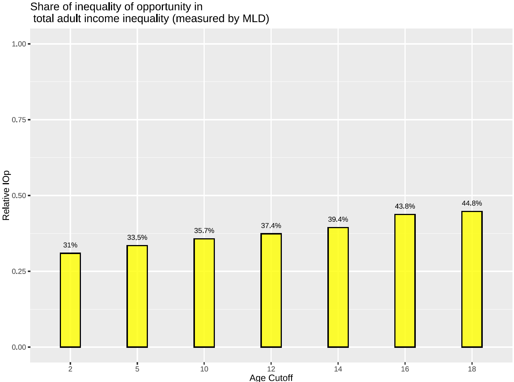

### Abstract 

The egalitarian principle of justice attributes life success to two main factors: circumstances beyond an individual's control and personal effort within it. 
Roemer's equality of opportunity concept proposes compensating individuals for inequalities arising from unequal circumstances. Dynamic complementarity in skill 
formation suggests that early childhood skill gaps often persist into adulthood, leading to unequal outcomes. Using PSID data, I classify all measurable factors
before age 18 (the age of majority) as circumstances, creating sets based on critical childhood stages to account for dynamic complementarity. My findings show that
over 40% of total income inequality can be attributed to inequality of opportunity before adulthood. Moreover, nearly one-third of total income inequality stems from
circumstances faced by individuals at or before age five. Using only circumstances identified as important through a random forest—a supervised machine learning
model—based on permutation-based importance scores, I estimate the lower bound of inequality of opportunity's share in total inequality before the age of majority 
to be about 31%. These results underscore the importance of considering childhood circumstances when measuring inequality of opportunity. This consideration is 
crucial for any public policy involving ex-post compensation or ex-ante investment in human capital to equalize opportunities.

