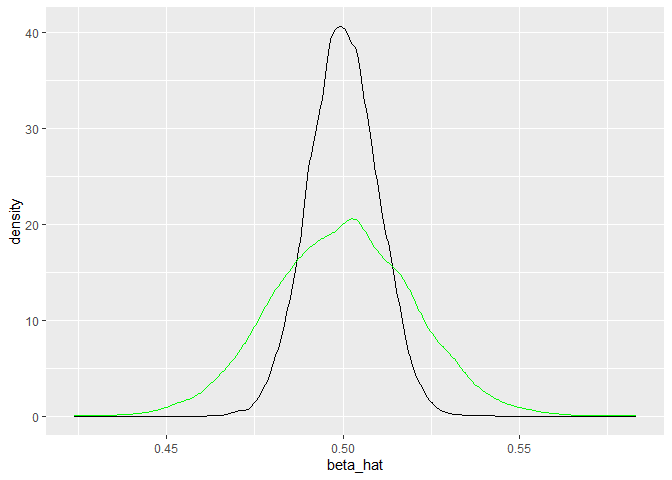
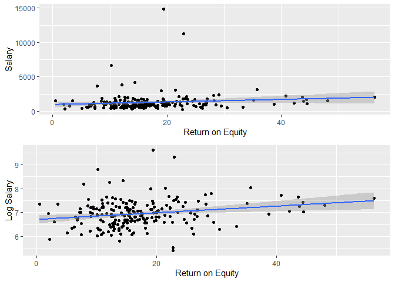
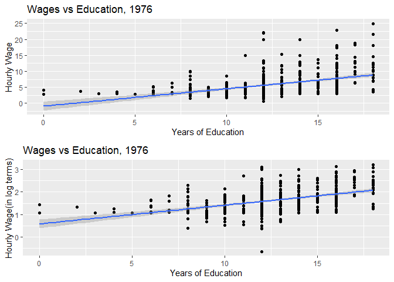
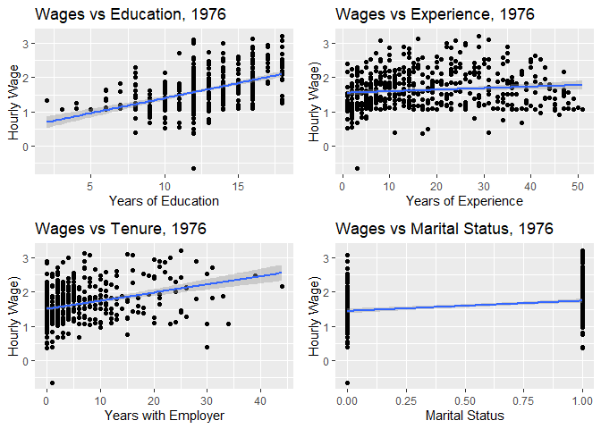
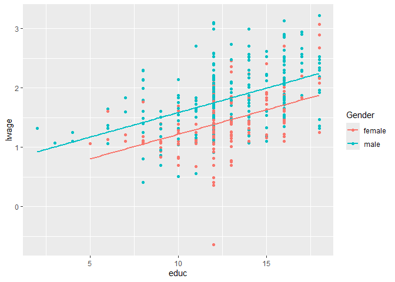

<style type="text/css">

h1 {
  font-family: 'Source Sans Pro', sans-serif;
  font-size: 28px;
  color: #333333;
  border-bottom: 2px solid #333333;
  padding-bottom: 10px;
}

h2 {
  font-family: 'Source Sans Pro', sans-serif;
  font-size: 24px;
  color: #444444;
  border-bottom: 1px solid #444444;
  padding-bottom: 8px;
}

h3 {
  font-family: 'Source Sans Pro', sans-serif;
  font-size: 20px;
  color: #555555;
  font-style: italic;
}

body {
  font-family: 'Source Sans Pro', sans-serif;
  font-weight: 400;
}
</style>

<style type="text/css">

table, td, th {
  border: none;
  padding-left: 1em;
  padding-right: 1em;
  margin-left: auto;
  margin-right: auto;
  margin-top: 1em;
  margin-bottom: 1em;
}

</style>


 

``` r
packages <- c("tidyverse","stargazer","AER","asbio","tigerstats","readxl","foreign","wooldridge","moderndive","gridExtra","haven","car") ## This is how you define an object (which is a vector here)
install.packages(packages, repos='http://cran.us.r-project.org') # Installing packages at once
lapply(packages, library, character.only = T) # Loading the packages
```

## Reading data files into R

Below are some ways to load the data files in different formats. To load excel and Stata data files, you will need to install the packages "readxl" and "foreign" respectively.


``` r
bwsmoking_excel <- read_xlsx("S:\\Baruch\\ECO 4000\\Spring2022\\Datasets\\Birthweight and Smoking\\birthweight_smoking.xlsx")

## Read a csv file

bwsmoking_csv <- read_csv("S:\\Baruch\\ECO 4000\\Spring2022\\Datasets\\Birthweight and Smoking\\bwsmoking.csv")

## Read a STATA file (will require package named "haven")

bwsmoking_stata <- read_dta("S:\\Baruch\\ECO 4000\\Spring2022\\Datasets\\Birthweight and Smoking\\birthweight_smoking.dta")

## Read an RDS file 

bwsmoking_R <- readRDS("S:\\Baruch\\ECO 4000\\Spring2022\\Datasets\\Birthweight and Smoking\\bwsmoking.rds")
```


## One Sample Hypothesis Testing
These examples are from the practice problem set provided to the students. 

### Problem 9
**A company claims that its soup machines deliver exactly 10.0 ounces of soup—no more, no less. A researcher samples 100 bowls of soup and finds that:**

$\overline{X}$= 10.28 ounces\
s = 1.20 ounces\
Test the company’s claim at 5% and 1% significance level. 

We denote null hypothesis as $H_{0}$ and alternative hypothesis as $H_{1}$.

$$H_{0} :\mu = 10$$
$$H_{1} :\mu \neq 10$$

We define z-statistic in terms of the sample mean, sample size, and the population standard deviation $\sigma$

$z = \frac{\overline{X} - \mu_{0}}{\bigg(\frac{\sigma}{\sqrt{n}}\bigg)}$ \

We reject the null hypothesis if $|z| \geq |z_{\frac{\alpha}{2}}|$, where $|z|$ is the absolute value of the z-statistic we calculated and $|z_{\frac{\alpha}{2}}|$ is the critical value we obtain from the table. Notice that we use $|z_{\frac{\alpha}{2}}|$ here because we are conducting a two-sided test. \

We reject the null hypothesis if p-value $\leq \frac{\alpha}{2}$, where $\alpha$ is a significance level.(we will often use 0.01,0.05,and 0.1 values for $\alpha$ for our purposes.)


``` r
# A function to calculate z scores and compare them with critical values of z (ones we obtain from the table)
z_test <- function(mu,x_bar,s,n,alpha,alternative){
  sd = s/sqrt(n)
  z <- (x_bar - mu)/(sd)
  if(alternative == "two-sided"){
    z_alpha = qnorm((1-alpha/2)) 
  }
  else if(alternative == "less"){
  z_alpha = -qnorm((1-alpha))
  }
  else if(alternative == "greater"){
    z_alpha = qnorm((1-alpha))
  }
  else("NA")
  
  z_list = list("|z_calculated|" = abs(z), "|z_critical|" = abs(z_alpha))
  return(z_list)
}
```

``` r
set.seed(21)
Q_9 <- tibble(X = rnorm(mean = 10.28, sd = 0.12, n = 100)) # Our simulated data
z_05 <- z_test(10,10.28,s = 1.2,100,0.05, alternative = "two-sided") ## a two-sided test at 5 % significance level
z_05
```

```
## $`|z_calculated|`
## [1] 2.333333
## 
## $`|z_critical|`
## [1] 1.959964
```

``` r
t.test(x = Q_9$X, mu = 10, alternative = "two.sided")
```

```
## 
## 	One Sample t-test
## 
## data:  Q_9$X
## t = 23.422, df = 99, p-value < 2.2e-16
## alternative hypothesis: true mean is not equal to 10
## 95 percent confidence interval:
##  10.26424 10.31316
## sample estimates:
## mean of x 
##   10.2887
```

As we notice here, the absolute value of z-calculated = 2.33 is greater than the absolute value of z-critical = 1.96. Therefore, we reject the null hypothesis being $\mu = 10$


``` r
z_01 <- z_test(10,10.28,s = 1.2,100,0.01, alternative = "two-sided") ## a two-sided test at 1 % significance level
z_01
```

```
## $`|z_calculated|`
## [1] 2.333333
## 
## $`|z_critical|`
## [1] 2.575829
```

As we notice above, the absolute value of z-calculated = 2.33 is less than the absolute value of z-critical = 2.58. Therefore,we fail reject the null hypothesis being $\mu = 10$

### Problem - 6

**A manufacturer produces drill bits with an intended life of at least 580 hours and a standard deviation of 30 hours. A quality control scientist draws a sample of 100 bits and finds $\overline{X}=577$. Test at $\alpha =.05$ to see if the machinery needs adjusting.**


$$H_{0} :\mu \geq 580$$
$$H_{1} :\mu < 580$$

<!-- -->


``` r
set.seed(121)
Q_6 <- tibble(X = rnorm(mean = 577, sd = 30, n = 100)) # dataset with N ~ (577,900) (it does not have to be normal though. Recall Central Limit Theorem!)
z_one_sided <- z_test(mu = 580, x_bar = 577, s = 30, n = 100, alpha = 0.05, alternative = "less")
z_one_sided
```

```
## $`|z_calculated|`
## [1] 1
## 
## $`|z_critical|`
## [1] 1.644854
```

As we can notice above, the absolute value of z-calculated = 1 is less than the absolute value of z-critical = 1.64. Therefore,we fail reject the null hypothesis being $\mu = 580$.


### Problem - 4

**A drug company that manufactures a diet drug claims that those using the drug for 30 days will lose at least 15 pounds. You sample 30 people who have used the drug and find that the average weight loss was 12 pounds with a standard deviation of 5 pounds. (Hint : When sample is small enough i.e. $n \leq 30$ use a t-test). Test the claim at the .05 significance level. **

$$H_{0} :\mu \geq 15$$
$$H_{1} :\mu < 15$$


``` r
t_test <- function(mu,x_bar,s,n,alpha,alternative){
  sd = s/sqrt(n)
  t <- (x_bar - mu)/(sd)
  if(alternative == "two-sided"){
    t_alpha = qt(alpha/2,df = n-1)
  }
  else if(alternative == "less"){
    t_alpha = - qt(1-alpha, df= n-1)
  }
  else if(alternative == "greater"){
    t_alpha = qt(1-alpha, df= n-1)
  }
  else("NA")
  
  t_list = list("|t_calculated|" = abs(t), "|t_critical|" = abs(t_alpha))
  return(t_list)
}


t_one_sided <- t_test(15,12,s = 5,n=30,0.05,alternative = "less")

t_one_sided
```

```
## $`|t_calculated|`
## [1] 3.286335
## 
## $`|t_critical|`
## [1] 1.699127
```

``` r
z_one_sided <- z_test(15,12,s = 5,n=30,0.05,alternative = "less")
z_one_sided
```

```
## $`|z_calculated|`
## [1] 3.286335
## 
## $`|z_critical|`
## [1] 1.644854
```

``` r
pvalt <- 2 * pt(-t_one_sided$`|t_calculated|`,29) # p value calculation
pvalt
```

```
## [1] 0.002658998
```
As we notice above, the absolute value of t-calculated = 3.29 is greater than the absolute value of t-critical = 1.69. Therefore,we reject the null hypothesis being $\mu = 15$.

p-value here is 0.002 which is less than 0.05. Therefore,we reject the null hypothesis being $\mu = 15$. 


## Monte Carlo Simulation to Confirm the Unbiasedness of the Slope Parameter


``` r
## POPULATION PARAMETERS
B0 = 2
B1 = 0.5


n = 10000

coeffs <- tibble(b_0 = rep(0,n),b_1 = rep(0,n))

for (i in 1:n) {
  
  dat1 <- tibble(X = 1:50, u = rnorm(50), Y = B0 + B1*X + u)
  reg <- lm(Y~X, data = dat1)
  model <- summary(reg)
  
  coeffs$b_0[i] = model$coefficients[1,1]
  coeffs$b_1[i] = model$coefficients[2,1]
  
}

### With increased error

coeffs_2 <- tibble(b_02 = rep(0,n),b_12 = rep(0,n))

for (i in 1:n) {
  
  dat2 <- tibble(X = 1:50, u = rnorm(50), Y = B0 + B1*X + 2*u)
  reg2 <- lm(Y~X, data = dat2)
  model2 <- summary(reg2)
  
  coeffs_2$b_02[i] = model2$coefficients[1,1]
  coeffs_2$b_12[i] = model2$coefficients[2,1]
  
}


##### Plot the data

ggplot(data = coeffs, aes(x = b_1), color = "blue")+
  geom_density()+
  geom_density(data = coeffs_2, aes(x = b_12), color = "green")+
  xlab("beta_hat")
```

<!-- -->

## Simple Linear Regression : Results Interpretation 

For this exercise we will require to install r package "wooldridge". This package contains all the data that are used in [Wooldridge's Introductory Econometrics](https://www.cengage.com/c/introductory-econometrics-a-modern-approach-6e-wooldridge/9781305270107/) textbook. We will use those data sets for our purpose.

**E1. For the population of chief executive officers, let Y be annual salary (salary) in thousands of dollars.Thus, y = 856.3 indicates an annual salary of $856,300, and y = 1,452.6 indicates a salary of \$1,452,600. Let X be the average return on equity (roe) for the CEO’s firm for the previous three years. (Return on equity is defined in terms of net income as a percentage of common equity.) For example, if roe = 10, then average return on equity is 10%.**

We postulate that our model is 

$$salary = \beta_{0} + \beta_{1} roe + u$$

The slope parameter $\beta_{1}$ measure the change in annual salary when the return on equity increases by one percentage point. Since, a higher *roe* is good for the company, we expect $\beta_{1}$ to be positive.


``` r
load("S:\\Baruch\\ECO 4000\\Spring2022\\Datasets\\ceosal1.RData")
ceo1 <- data

## Summary Statistics

stargazer(ceo1, type = "html",digits = 2, title = "Descriptive Statistics")
```


<table style="text-align:center"><caption><strong>Descriptive Statistics</strong></caption>
<tr><td colspan="6" style="border-bottom: 1px solid black"></td></tr><tr><td style="text-align:left">Statistic</td><td>N</td><td>Mean</td><td>St. Dev.</td><td>Min</td><td>Max</td></tr>
<tr><td colspan="6" style="border-bottom: 1px solid black"></td></tr><tr><td style="text-align:left">salary</td><td>209</td><td>1,281.12</td><td>1,372.35</td><td>223</td><td>14,822</td></tr>
<tr><td style="text-align:left">pcsalary</td><td>209</td><td>13.28</td><td>32.63</td><td>-61</td><td>212</td></tr>
<tr><td style="text-align:left">sales</td><td>209</td><td>6,923.79</td><td>10,633.27</td><td>175.20</td><td>97,649.90</td></tr>
<tr><td style="text-align:left">roe</td><td>209</td><td>17.18</td><td>8.52</td><td>0.50</td><td>56.30</td></tr>
<tr><td style="text-align:left">pcroe</td><td>209</td><td>10.80</td><td>97.22</td><td>-98.90</td><td>977.00</td></tr>
<tr><td style="text-align:left">ros</td><td>209</td><td>61.80</td><td>68.18</td><td>-58</td><td>418</td></tr>
<tr><td style="text-align:left">indus</td><td>209</td><td>0.32</td><td>0.47</td><td>0</td><td>1</td></tr>
<tr><td style="text-align:left">finance</td><td>209</td><td>0.22</td><td>0.42</td><td>0</td><td>1</td></tr>
<tr><td style="text-align:left">consprod</td><td>209</td><td>0.29</td><td>0.45</td><td>0</td><td>1</td></tr>
<tr><td style="text-align:left">utility</td><td>209</td><td>0.17</td><td>0.38</td><td>0</td><td>1</td></tr>
<tr><td style="text-align:left">lsalary</td><td>209</td><td>6.95</td><td>0.57</td><td>5.41</td><td>9.60</td></tr>
<tr><td style="text-align:left">lsales</td><td>209</td><td>8.29</td><td>1.01</td><td>5.17</td><td>11.49</td></tr>
<tr><td colspan="6" style="border-bottom: 1px solid black"></td></tr></table>

Always start with looking at the summary statistics of your data. It is helpful to get the feel of the data before we start our analysis.The data set **CEOSAL1** contains information on 209 CEOs for the year 1990; these data were obtained from Business Week (5/6/91). In this sample, the average annual salary is \$1,281,120, with the smallest and largest being \$223,000 and $14,822,000, respectively. The average return on equity for the years 1988, 1989, and 1990 is 17.18%, with the smallest and largest values being 0.5% and 56.3%, respectively.


``` r
## plot the data 
p1 <- ggplot(data = ceo1, aes(x = roe, y = salary)) +
  geom_point()+
  geom_smooth(method = "lm")+
  xlab("Return on Equity")+
  ylab("Salary")

p2 <- ggplot(data = ceo1, aes(x = roe, y = lsalary)) +  ## Just for your reference
  geom_point()+
  geom_smooth(method = "lm")+
  xlab("Return on Equity")+
  ylab("Log Salary")

gridExtra::grid.arrange(p1,p2)
```

<!-- -->

We have the results after fitting the model. Out fitted model looks like this

$$\widehat{salary} = 963.191 + 18.501 roe$$

``` r
model_1 <- lm(data = ceo1, salary ~ roe) # level - level
model_2 <- lm(data = ceo1, lsalary ~ roe) # log-level
stargazer(model_1,model_2, type = "html",dep.var.labels = c("Salary","Log Salary"), title = "CEO Salary and Return on Equity", style = "qje",notes.append = FALSE,notes = c("<sup>&sstarf;</sup>p<0.1; <sup>&sstarf;&sstarf;</sup>p<0.05; <sup>&sstarf;&sstarf;&sstarf;</sup>p<0.01"))
```


<table style="text-align:center"><caption><strong>CEO Salary and Return on Equity</strong></caption>
<tr><td colspan="3" style="border-bottom: 1px solid black"></td></tr><tr><td style="text-align:left"></td><td>Salary</td><td>Log Salary</td></tr>
<tr><td style="text-align:left"></td><td>(1)</td><td>(2)</td></tr>
<tr><td colspan="3" style="border-bottom: 1px solid black"></td></tr><tr><td style="text-align:left">roe</td><td>18.501<sup>*</sup></td><td>0.014<sup>***</sup></td></tr>
<tr><td style="text-align:left"></td><td>(11.123)</td><td>(0.005)</td></tr>
<tr><td style="text-align:left"></td><td></td><td></td></tr>
<tr><td style="text-align:left">Constant</td><td>963.191<sup>***</sup></td><td>6.712<sup>***</sup></td></tr>
<tr><td style="text-align:left"></td><td>(213.240)</td><td>(0.087)</td></tr>
<tr><td style="text-align:left"></td><td></td><td></td></tr>
<tr><td style="text-align:left"><em>N</em></td><td>209</td><td>209</td></tr>
<tr><td style="text-align:left">R<sup>2</sup></td><td>0.013</td><td>0.043</td></tr>
<tr><td style="text-align:left">Adjusted R<sup>2</sup></td><td>0.008</td><td>0.039</td></tr>
<tr><td style="text-align:left">Residual Std. Error (df = 207)</td><td>1,366.555</td><td>0.555</td></tr>
<tr><td style="text-align:left">F Statistic (df = 1; 207)</td><td>2.767<sup>*</sup></td><td>9.408<sup>***</sup></td></tr>
<tr><td colspan="3" style="border-bottom: 1px solid black"></td></tr><tr><td style="text-align:left"><em>Notes:</em></td><td colspan="2" style="text-align:right"><sup>&sstarf;</sup>p<0.1; <sup>&sstarf;&sstarf;</sup>p<0.05; <sup>&sstarf;&sstarf;&sstarf;</sup>p<0.01</td></tr>
</table>

where the intercept and slope estimates have been rounded to three decimal places; we use “salary hat” to indicate that this is an estimated equation. 

**How do we interpret the equation?**

First, if the return on equity is zero, roe = 0, then the predicted salary is the intercept, 963.191, which equals $963,191
because salary is measured in thousands. Next, we can write the predicted change in salary as a function
of the change in roe: $\widehat{\Delta salary} = 18.501 (\Delta roe)$. This means that if the return on equity increases by one percentage point, $(\Delta roe) = 1$ , then salary is predicted to change by about 18.5, or $18,500.

Because it is a linear equation, this is the estimated change regardless of the initial salary.


**Question** :  What is the predicted salary of a CEO if the return on equity is 30 percent?

We can use our fitted model, $\widehat{salary},  = 963.191 + 18.501 roe$. Plug in the value of roe = 30. i.e. $\widehat{salary} = 963.191 + 18.501 (30) = 1,518,221$, which is over \$1.5 million dollars. This is the predicted value that our model gives us. Now, keep in mind as we talked about it in the class, the assumption of zero conditional mean does not satisfy in this case. There are other variables that could potentially affect the salary of a CEO. 


``` r
ceo1 <- ceo1%>%
  mutate(lroe = log(roe))
model_3 <- lm(data = ceo1, salary ~ lroe) # level-log
model_4 <- lm(data = ceo1, lsalary ~ roe) # log-level
model_5 <- lm(data = ceo1, lsalary ~ lroe) # log-log
stargazer(model_3,model_4, model_5,type = "html",dep.var.labels = c("Salary","Log Salary","Log Salary"), title = "CEO Salary and Return on Equity", style = "qje",notes.append = FALSE,notes = c("<sup>&sstarf;</sup>p<0.1; <sup>&sstarf;&sstarf;</sup>p<0.05; <sup>&sstarf;&sstarf;&sstarf;</sup>p<0.01"))
```


<table style="text-align:center"><caption><strong>CEO Salary and Return on Equity</strong></caption>
<tr><td colspan="4" style="border-bottom: 1px solid black"></td></tr><tr><td style="text-align:left"></td><td>Salary</td><td colspan="2">Log Salary</td></tr>
<tr><td style="text-align:left"></td><td>(1)</td><td>(2)</td><td>(3)</td></tr>
<tr><td colspan="4" style="border-bottom: 1px solid black"></td></tr><tr><td style="text-align:left">lroe</td><td>255.311</td><td></td><td>0.170<sup>**</sup></td></tr>
<tr><td style="text-align:left"></td><td>(173.884)</td><td></td><td>(0.071)</td></tr>
<tr><td style="text-align:left"></td><td></td><td></td><td></td></tr>
<tr><td style="text-align:left">roe</td><td></td><td>0.014<sup>***</sup></td><td></td></tr>
<tr><td style="text-align:left"></td><td></td><td>(0.005)</td><td></td></tr>
<tr><td style="text-align:left"></td><td></td><td></td><td></td></tr>
<tr><td style="text-align:left">Constant</td><td>586.596</td><td>6.712<sup>***</sup></td><td>6.489<sup>***</sup></td></tr>
<tr><td style="text-align:left"></td><td>(482.396)</td><td>(0.087)</td><td>(0.197)</td></tr>
<tr><td style="text-align:left"></td><td></td><td></td><td></td></tr>
<tr><td style="text-align:left"><em>N</em></td><td>209</td><td>209</td><td>209</td></tr>
<tr><td style="text-align:left">R<sup>2</sup></td><td>0.010</td><td>0.043</td><td>0.027</td></tr>
<tr><td style="text-align:left">Adjusted R<sup>2</sup></td><td>0.006</td><td>0.039</td><td>0.022</td></tr>
<tr><td style="text-align:left">Residual Std. Error (df = 207)</td><td>1,368.548</td><td>0.555</td><td>0.560</td></tr>
<tr><td style="text-align:left">F Statistic (df = 1; 207)</td><td>2.156</td><td>9.408<sup>***</sup></td><td>5.689<sup>**</sup></td></tr>
<tr><td colspan="4" style="border-bottom: 1px solid black"></td></tr><tr><td style="text-align:left"><em>Notes:</em></td><td colspan="3" style="text-align:right"><sup>&sstarf;</sup>p<0.1; <sup>&sstarf;&sstarf;</sup>p<0.05; <sup>&sstarf;&sstarf;&sstarf;</sup>p<0.01</td></tr>
</table>

## Simple Linear Regression with Logarithms : Results Interpretation 

**Analysis of Wage and Education Data, (1976 CPS)**


``` r
## Summary Statistics

stargazer(wage1, type = "html",digits = 2, title = "Descriptive Statistics")
```


<table style="text-align:center"><caption><strong>Descriptive Statistics</strong></caption>
<tr><td colspan="6" style="border-bottom: 1px solid black"></td></tr><tr><td style="text-align:left">Statistic</td><td>N</td><td>Mean</td><td>St. Dev.</td><td>Min</td><td>Max</td></tr>
<tr><td colspan="6" style="border-bottom: 1px solid black"></td></tr><tr><td style="text-align:left">wage</td><td>526</td><td>5.90</td><td>3.69</td><td>0.53</td><td>24.98</td></tr>
<tr><td style="text-align:left">educ</td><td>526</td><td>12.56</td><td>2.77</td><td>0</td><td>18</td></tr>
<tr><td style="text-align:left">exper</td><td>526</td><td>17.02</td><td>13.57</td><td>1</td><td>51</td></tr>
<tr><td style="text-align:left">tenure</td><td>526</td><td>5.10</td><td>7.22</td><td>0</td><td>44</td></tr>
<tr><td style="text-align:left">nonwhite</td><td>526</td><td>0.10</td><td>0.30</td><td>0</td><td>1</td></tr>
<tr><td style="text-align:left">female</td><td>526</td><td>0.48</td><td>0.50</td><td>0</td><td>1</td></tr>
<tr><td style="text-align:left">married</td><td>526</td><td>0.61</td><td>0.49</td><td>0</td><td>1</td></tr>
<tr><td style="text-align:left">numdep</td><td>526</td><td>1.04</td><td>1.26</td><td>0</td><td>6</td></tr>
<tr><td style="text-align:left">smsa</td><td>526</td><td>0.72</td><td>0.45</td><td>0</td><td>1</td></tr>
<tr><td style="text-align:left">northcen</td><td>526</td><td>0.25</td><td>0.43</td><td>0</td><td>1</td></tr>
<tr><td style="text-align:left">south</td><td>526</td><td>0.36</td><td>0.48</td><td>0</td><td>1</td></tr>
<tr><td style="text-align:left">west</td><td>526</td><td>0.17</td><td>0.38</td><td>0</td><td>1</td></tr>
<tr><td style="text-align:left">construc</td><td>526</td><td>0.05</td><td>0.21</td><td>0</td><td>1</td></tr>
<tr><td style="text-align:left">ndurman</td><td>526</td><td>0.11</td><td>0.32</td><td>0</td><td>1</td></tr>
<tr><td style="text-align:left">trcommpu</td><td>526</td><td>0.04</td><td>0.20</td><td>0</td><td>1</td></tr>
<tr><td style="text-align:left">trade</td><td>526</td><td>0.29</td><td>0.45</td><td>0</td><td>1</td></tr>
<tr><td style="text-align:left">services</td><td>526</td><td>0.10</td><td>0.30</td><td>0</td><td>1</td></tr>
<tr><td style="text-align:left">profserv</td><td>526</td><td>0.26</td><td>0.44</td><td>0</td><td>1</td></tr>
<tr><td style="text-align:left">profocc</td><td>526</td><td>0.37</td><td>0.48</td><td>0</td><td>1</td></tr>
<tr><td style="text-align:left">clerocc</td><td>526</td><td>0.17</td><td>0.37</td><td>0</td><td>1</td></tr>
<tr><td style="text-align:left">servocc</td><td>526</td><td>0.14</td><td>0.35</td><td>0</td><td>1</td></tr>
<tr><td style="text-align:left">lwage</td><td>526</td><td>1.62</td><td>0.53</td><td>-0.63</td><td>3.22</td></tr>
<tr><td style="text-align:left">expersq</td><td>526</td><td>473.44</td><td>616.04</td><td>1</td><td>2,601</td></tr>
<tr><td style="text-align:left">tenursq</td><td>526</td><td>78.15</td><td>199.43</td><td>0</td><td>1,936</td></tr>
<tr><td colspan="6" style="border-bottom: 1px solid black"></td></tr></table>


``` r
### Wage-Education
w1 <- ggplot(data = wage1, aes(x = educ, y = wage)) +
  geom_point()+
  geom_smooth(method = "lm")+
  xlab("Years of Education")+
  ylab("Hourly Wage")+
  labs(title = "Wages vs Education, 1976")

w2 <- ggplot(data = wage1, aes(x = educ, y = lwage)) +
  geom_point()+
  geom_smooth(method = "lm")+
  xlab("Years of Education")+
  ylab("Hourly Wage(in log terms)")+
  labs(title = "Wages vs Education, 1976")

gridExtra::grid.arrange(w1,w2)
```

<!-- -->


``` r
## Regression Analysis
wmodel_1 <- lm(data = wage1, wage ~ educ)
wmodel_2 <- lm(data = wage1, lwage ~ educ)

wage1 = wage1%>%
  filter(educ != 0)%>%
  mutate(leduc = log(educ))
wmodel_3 <- lm(data = wage1, wage ~ leduc)
wmodel_4 <- lm(data = wage1, lwage ~ leduc)
stargazer(wmodel_1, wmodel_2,wmodel_3,wmodel_4,type = "html",dep.var.labels = c("wage","log wage","wage","log wage"), title = "Wage and Education", style = "qje",notes.append = FALSE,notes = c("<sup>&sstarf;</sup>p<0.1; <sup>&sstarf;&sstarf;</sup>p<0.05; <sup>&sstarf;&sstarf;&sstarf;</sup>p<0.01"))
```


<table style="text-align:center"><caption><strong>Wage and Education</strong></caption>
<tr><td colspan="5" style="border-bottom: 1px solid black"></td></tr><tr><td style="text-align:left"></td><td>wage</td><td>log wage</td><td>wage</td><td>log wage</td></tr>
<tr><td style="text-align:left"></td><td>(1)</td><td>(2)</td><td>(3)</td><td>(4)</td></tr>
<tr><td colspan="5" style="border-bottom: 1px solid black"></td></tr><tr><td style="text-align:left">educ</td><td>0.541<sup>***</sup></td><td>0.083<sup>***</sup></td><td></td><td></td></tr>
<tr><td style="text-align:left"></td><td>(0.053)</td><td>(0.008)</td><td></td><td></td></tr>
<tr><td style="text-align:left"></td><td></td><td></td><td></td><td></td></tr>
<tr><td style="text-align:left">leduc</td><td></td><td></td><td>5.330<sup>***</sup></td><td>0.825<sup>***</sup></td></tr>
<tr><td style="text-align:left"></td><td></td><td></td><td>(0.608)</td><td>(0.086)</td></tr>
<tr><td style="text-align:left"></td><td></td><td></td><td></td><td></td></tr>
<tr><td style="text-align:left">Constant</td><td>-0.905</td><td>0.584<sup>***</sup></td><td>-7.460<sup>***</sup></td><td>-0.445<sup>**</sup></td></tr>
<tr><td style="text-align:left"></td><td>(0.685)</td><td>(0.097)</td><td>(1.532)</td><td>(0.218)</td></tr>
<tr><td style="text-align:left"></td><td></td><td></td><td></td><td></td></tr>
<tr><td style="text-align:left"><em>N</em></td><td>526</td><td>526</td><td>524</td><td>524</td></tr>
<tr><td style="text-align:left">R<sup>2</sup></td><td>0.165</td><td>0.186</td><td>0.128</td><td>0.149</td></tr>
<tr><td style="text-align:left">Adjusted R<sup>2</sup></td><td>0.163</td><td>0.184</td><td>0.127</td><td>0.147</td></tr>
<tr><td style="text-align:left">Residual Std. Error</td><td>3.378 (df = 524)</td><td>0.480 (df = 524)</td><td>3.455 (df = 522)</td><td>0.491 (df = 522)</td></tr>
<tr><td style="text-align:left">F Statistic</td><td>103.363<sup>***</sup> (df = 1; 524)</td><td>119.582<sup>***</sup> (df = 1; 524)</td><td>76.849<sup>***</sup> (df = 1; 522)</td><td>91.119<sup>***</sup> (df = 1; 522)</td></tr>
<tr><td colspan="5" style="border-bottom: 1px solid black"></td></tr><tr><td style="text-align:left"><em>Notes:</em></td><td colspan="4" style="text-align:right"><sup>&sstarf;</sup>p<0.1; <sup>&sstarf;&sstarf;</sup>p<0.05; <sup>&sstarf;&sstarf;&sstarf;</sup>p<0.01</td></tr>
</table>


- In regression 1, **1 year** increase in education is associated with **$0.541** increase in hourly wage.

- In regression 2, an increase in education by **1 year** is associated with $100 \times \hat{\beta_{1}}$ = 100 x 0.083 = **8.3 %** increase in hourly wage.

- In regression 3, **1 %** increase in education is associated with $\frac{1}{100} \times \hat{\beta_{1}}$ = $\frac{1}{100} \times 5.33$ = **$ 0.0533** increase in hourly wage.

- In regression 4, **1 %** increase in education is associated with $\hat{\beta_{1}}$ %  = **0.83 %** increase in hourly wage. (This gives us Elasticity! Recall from your economics class.)


We can not compare $R^{2}$ values when the dependent variables are different. For instance, in the table above, we are not able to compare regression 1 and 2 since the dependent variables are wage and log(wage) respectively. In these situations we rely on our knowledge of economic theory and make decisions based on that. For example, it is standard practice to have a regression model like regression 2 in labor economics. 

## Multiple Regression Analysis : Results Interpretation


``` r
m1 <- ggplot(data = wage1, aes(x = educ, y = lwage)) +
  geom_point()+
  geom_smooth(method = "lm")+
  xlab("Years of Education")+
  ylab("Hourly Wage")+
  labs(title = "Wages vs Education, 1976")

m2 <- ggplot(data = wage1, aes(x = exper, y = lwage)) +
  geom_point()+
  geom_smooth(method = "lm")+
  xlab("Years of Experience")+
  ylab("Hourly Wage)")+
  labs(title = "Wages vs Experience, 1976")

m3 <- ggplot(data = wage1, aes(x = tenure, y = lwage)) +
  geom_point()+
  geom_smooth(method = "lm")+
  xlab("Years with Employer")+
  ylab("Hourly Wage)")+
  labs(title = "Wages vs Tenure, 1976")

m4 <- ggplot(data = wage1, aes(x = married, y = lwage)) +
  geom_point()+
  geom_smooth(method = "lm")+
  xlab("Marital Status")+
  ylab("Hourly Wage)")+
  labs(title = "Wages vs Marital Status, 1976")

gridExtra::grid.arrange(m1,m2,m3,m4)
```

<!-- -->


``` r
## Regression Analysis
multiple_1 <- lm(data = wage1, wage ~ educ)
multiple_2 <- lm(data = wage1, lwage ~ educ)
multiple_3 <- lm(data = wage1, lwage ~ educ + exper)
multiple_4 <- lm(data = wage1, lwage ~ educ + exper + tenure)
multiple_5 <- lm(data = wage1, lwage ~ educ + exper + tenure + married)
stargazer(multiple_1, multiple_2,multiple_3,multiple_4,multiple_5,type = "html",dep.var.labels = c("wage","log wage"), title = "Wage and Education", style = "qje",notes.append = FALSE,notes = c("<sup>&sstarf;</sup>p<0.1; <sup>&sstarf;&sstarf;</sup>p<0.05; <sup>&sstarf;&sstarf;&sstarf;</sup>p<0.01"))
```


<table style="text-align:center"><caption><strong>Wage and Education</strong></caption>
<tr><td colspan="6" style="border-bottom: 1px solid black"></td></tr><tr><td style="text-align:left"></td><td>wage</td><td colspan="4">log wage</td></tr>
<tr><td style="text-align:left"></td><td>(1)</td><td>(2)</td><td>(3)</td><td>(4)</td><td>(5)</td></tr>
<tr><td colspan="6" style="border-bottom: 1px solid black"></td></tr><tr><td style="text-align:left">educ</td><td>0.572<sup>***</sup></td><td>0.087<sup>***</sup></td><td>0.103<sup>***</sup></td><td>0.097<sup>***</sup></td><td>0.092<sup>***</sup></td></tr>
<tr><td style="text-align:left"></td><td>(0.055)</td><td>(0.008)</td><td>(0.008)</td><td>(0.008)</td><td>(0.008)</td></tr>
<tr><td style="text-align:left"></td><td></td><td></td><td></td><td></td><td></td></tr>
<tr><td style="text-align:left">exper</td><td></td><td></td><td>0.010<sup>***</sup></td><td>0.004<sup>**</sup></td><td>0.002</td></tr>
<tr><td style="text-align:left"></td><td></td><td></td><td>(0.002)</td><td>(0.002)</td><td>(0.002)</td></tr>
<tr><td style="text-align:left"></td><td></td><td></td><td></td><td></td><td></td></tr>
<tr><td style="text-align:left">tenure</td><td></td><td></td><td></td><td>0.022<sup>***</sup></td><td>0.021<sup>***</sup></td></tr>
<tr><td style="text-align:left"></td><td></td><td></td><td></td><td>(0.003)</td><td>(0.003)</td></tr>
<tr><td style="text-align:left"></td><td></td><td></td><td></td><td></td><td></td></tr>
<tr><td style="text-align:left">married</td><td></td><td></td><td></td><td></td><td>0.167<sup>***</sup></td></tr>
<tr><td style="text-align:left"></td><td></td><td></td><td></td><td></td><td>(0.042)</td></tr>
<tr><td style="text-align:left"></td><td></td><td></td><td></td><td></td><td></td></tr>
<tr><td style="text-align:left">Constant</td><td>-1.302<sup>*</sup></td><td>0.525<sup>***</sup></td><td>0.150</td><td>0.217<sup>**</sup></td><td>0.218<sup>**</sup></td></tr>
<tr><td style="text-align:left"></td><td>(0.714)</td><td>(0.101)</td><td>(0.112)</td><td>(0.107)</td><td>(0.106)</td></tr>
<tr><td style="text-align:left"></td><td></td><td></td><td></td><td></td><td></td></tr>
<tr><td style="text-align:left"><em>N</em></td><td>524</td><td>524</td><td>524</td><td>524</td><td>524</td></tr>
<tr><td style="text-align:left">R<sup>2</sup></td><td>0.169</td><td>0.191</td><td>0.256</td><td>0.322</td><td>0.342</td></tr>
<tr><td style="text-align:left">Adjusted R<sup>2</sup></td><td>0.168</td><td>0.189</td><td>0.253</td><td>0.318</td><td>0.337</td></tr>
<tr><td style="text-align:left">Residual Std. Error</td><td>3.372 (df = 522)</td><td>0.479 (df = 522)</td><td>0.460 (df = 521)</td><td>0.439 (df = 520)</td><td>0.433 (df = 519)</td></tr>
<tr><td style="text-align:left">F Statistic</td><td>106.506<sup>***</sup> (df = 1; 522)</td><td>123.032<sup>***</sup> (df = 1; 522)</td><td>89.545<sup>***</sup> (df = 2; 521)</td><td>82.375<sup>***</sup> (df = 3; 520)</td><td>67.558<sup>***</sup> (df = 4; 519)</td></tr>
<tr><td colspan="6" style="border-bottom: 1px solid black"></td></tr><tr><td style="text-align:left"><em>Notes:</em></td><td colspan="5" style="text-align:right"><sup>&sstarf;</sup>p<0.1; <sup>&sstarf;&sstarf;</sup>p<0.05; <sup>&sstarf;&sstarf;&sstarf;</sup>p<0.01</td></tr>
</table>

### Binary Independent Variables and Interaction Terms


``` r
## Regression Analysis
mod_1 <- lm(data = wage1, lwage ~ female)
mod_2 <- lm(data = wage1, lwage ~ female + educ)
mod_3 <- lm(data = wage1, lwage ~ female + educ + exper)
mod_4 <- lm(data = wage1, lwage ~ female + educ + exper + tenure)
mod_5 <- lm(data = wage1, lwage ~ female + educ + exper + tenure + married)
mod_6 <- lm(data = wage1, lwage ~ female + educ + exper + tenure + female*educ)
mod_7 <- lm(data = wage1, lwage ~ female + educ + exper + tenure + female*educ + female*married)
stargazer(mod_1, mod_2,mod_3,mod_4,mod_5,mod_6,mod_7,type = "html",dep.var.labels = c("log wage"), title = "Wage and Gender", style = "qje",notes.append = FALSE,notes = c("<sup>&sstarf;</sup>p<0.1; <sup>&sstarf;&sstarf;</sup>p<0.05; <sup>&sstarf;&sstarf;&sstarf;</sup>p<0.01"))
```


<table style="text-align:center"><caption><strong>Wage and Gender</strong></caption>
<tr><td colspan="8" style="border-bottom: 1px solid black"></td></tr><tr><td style="text-align:left"></td><td colspan="7">log wage</td></tr>
<tr><td style="text-align:left"></td><td>(1)</td><td>(2)</td><td>(3)</td><td>(4)</td><td>(5)</td><td>(6)</td><td>(7)</td></tr>
<tr><td colspan="8" style="border-bottom: 1px solid black"></td></tr><tr><td style="text-align:left">female</td><td>-0.396<sup>***</sup></td><td>-0.365<sup>***</sup></td><td>-0.348<sup>***</sup></td><td>-0.306<sup>***</sup></td><td>-0.290<sup>***</sup></td><td>-0.407<sup>**</sup></td><td>-0.252</td></tr>
<tr><td style="text-align:left"></td><td>(0.043)</td><td>(0.039)</td><td>(0.037)</td><td>(0.037)</td><td>(0.037)</td><td>(0.186)</td><td>(0.184)</td></tr>
<tr><td style="text-align:left"></td><td></td><td></td><td></td><td></td><td></td><td></td><td></td></tr>
<tr><td style="text-align:left">educ</td><td></td><td>0.082<sup>***</sup></td><td>0.097<sup>***</sup></td><td>0.093<sup>***</sup></td><td>0.089<sup>***</sup></td><td>0.090<sup>***</sup></td><td>0.085<sup>***</sup></td></tr>
<tr><td style="text-align:left"></td><td></td><td>(0.007)</td><td>(0.007)</td><td>(0.007)</td><td>(0.007)</td><td>(0.009)</td><td>(0.009)</td></tr>
<tr><td style="text-align:left"></td><td></td><td></td><td></td><td></td><td></td><td></td><td></td></tr>
<tr><td style="text-align:left">exper</td><td></td><td></td><td>0.010<sup>***</sup></td><td>0.005<sup>***</sup></td><td>0.003<sup>*</sup></td><td>0.005<sup>***</sup></td><td>0.003<sup>**</sup></td></tr>
<tr><td style="text-align:left"></td><td></td><td></td><td>(0.001)</td><td>(0.002)</td><td>(0.002)</td><td>(0.002)</td><td>(0.002)</td></tr>
<tr><td style="text-align:left"></td><td></td><td></td><td></td><td></td><td></td><td></td><td></td></tr>
<tr><td style="text-align:left">tenure</td><td></td><td></td><td></td><td>0.017<sup>***</sup></td><td>0.017<sup>***</sup></td><td>0.017<sup>***</sup></td><td>0.015<sup>***</sup></td></tr>
<tr><td style="text-align:left"></td><td></td><td></td><td></td><td>(0.003)</td><td>(0.003)</td><td>(0.003)</td><td>(0.003)</td></tr>
<tr><td style="text-align:left"></td><td></td><td></td><td></td><td></td><td></td><td></td><td></td></tr>
<tr><td style="text-align:left">married</td><td></td><td></td><td></td><td></td><td>0.125<sup>***</sup></td><td></td><td>0.291<sup>***</sup></td></tr>
<tr><td style="text-align:left"></td><td></td><td></td><td></td><td></td><td>(0.040)</td><td></td><td>(0.055)</td></tr>
<tr><td style="text-align:left"></td><td></td><td></td><td></td><td></td><td></td><td></td><td></td></tr>
<tr><td style="text-align:left">female:educ</td><td></td><td></td><td></td><td></td><td></td><td>0.008</td><td>0.012</td></tr>
<tr><td style="text-align:left"></td><td></td><td></td><td></td><td></td><td></td><td>(0.014)</td><td>(0.014)</td></tr>
<tr><td style="text-align:left"></td><td></td><td></td><td></td><td></td><td></td><td></td><td></td></tr>
<tr><td style="text-align:left">female:married</td><td></td><td></td><td></td><td></td><td></td><td></td><td>-0.317<sup>***</sup></td></tr>
<tr><td style="text-align:left"></td><td></td><td></td><td></td><td></td><td></td><td></td><td>(0.074)</td></tr>
<tr><td style="text-align:left"></td><td></td><td></td><td></td><td></td><td></td><td></td><td></td></tr>
<tr><td style="text-align:left">Constant</td><td>1.814<sup>***</sup></td><td>0.759<sup>***</sup></td><td>0.407<sup>***</sup></td><td>0.428<sup>***</sup></td><td>0.418<sup>***</sup></td><td>0.464<sup>***</sup></td><td>0.369<sup>***</sup></td></tr>
<tr><td style="text-align:left"></td><td>(0.030)</td><td>(0.097)</td><td>(0.107)</td><td>(0.104)</td><td>(0.103)</td><td>(0.122)</td><td>(0.121)</td></tr>
<tr><td style="text-align:left"></td><td></td><td></td><td></td><td></td><td></td><td></td><td></td></tr>
<tr><td style="text-align:left"><em>N</em></td><td>524</td><td>524</td><td>524</td><td>524</td><td>524</td><td>524</td><td>524</td></tr>
<tr><td style="text-align:left">R<sup>2</sup></td><td>0.138</td><td>0.308</td><td>0.362</td><td>0.401</td><td>0.412</td><td>0.401</td><td>0.433</td></tr>
<tr><td style="text-align:left">Adjusted R<sup>2</sup></td><td>0.137</td><td>0.305</td><td>0.358</td><td>0.396</td><td>0.406</td><td>0.395</td><td>0.425</td></tr>
<tr><td style="text-align:left">Residual Std. Error</td><td>0.494 (df = 522)</td><td>0.443 (df = 521)</td><td>0.426 (df = 520)</td><td>0.413 (df = 519)</td><td>0.410 (df = 518)</td><td>0.414 (df = 518)</td><td>0.403 (df = 516)</td></tr>
<tr><td style="text-align:left">F Statistic</td><td>83.868<sup>***</sup> (df = 1; 522)</td><td>115.919<sup>***</sup> (df = 2; 521)</td><td>98.193<sup>***</sup> (df = 3; 520)</td><td>86.774<sup>***</sup> (df = 4; 519)</td><td>72.579<sup>***</sup> (df = 5; 518)</td><td>69.388<sup>***</sup> (df = 5; 518)</td><td>56.191<sup>***</sup> (df = 7; 516)</td></tr>
<tr><td colspan="8" style="border-bottom: 1px solid black"></td></tr><tr><td style="text-align:left"><em>Notes:</em></td><td colspan="7" style="text-align:right"><sup>&sstarf;</sup>p<0.1; <sup>&sstarf;&sstarf;</sup>p<0.05; <sup>&sstarf;&sstarf;&sstarf;</sup>p<0.01</td></tr>
</table>


### Parallel Slopes Model


``` r
wage_new <- wage1 %>%
  mutate(Gender = if_else(female == 1,"female","male"))
ggplot(data = wage_new, aes(x = educ, y = lwage, color = Gender)) +
  geom_point()+
  geom_parallel_slopes(se = FALSE)
```

<!-- -->


### Dummy Variable Trap


``` r
wage_new <- wage1%>%
  mutate(male = if_else(female == 1,0,1))
mod_m <- lm(data = wage_new, lwage ~ male)
mod_fm <- lm(data = wage_new, lwage ~ female)
mod_red <- lm(data = wage_new, lwage ~ female + male)
stargazer(mod_m,mod_fm,mod_red,type = "html",dep.var.labels = c("log wage"), title = "Wage and Gender", style = "qje",notes.append = FALSE,notes = c("<sup>&sstarf;</sup>p<0.1; <sup>&sstarf;&sstarf;</sup>p<0.05; <sup>&sstarf;&sstarf;&sstarf;</sup>p<0.01"))
```


<table style="text-align:center"><caption><strong>Wage and Gender</strong></caption>
<tr><td colspan="4" style="border-bottom: 1px solid black"></td></tr><tr><td style="text-align:left"></td><td colspan="3">log wage</td></tr>
<tr><td style="text-align:left"></td><td>(1)</td><td>(2)</td><td>(3)</td></tr>
<tr><td colspan="4" style="border-bottom: 1px solid black"></td></tr><tr><td style="text-align:left">male</td><td>0.396<sup>***</sup></td><td></td><td></td></tr>
<tr><td style="text-align:left"></td><td>(0.043)</td><td></td><td></td></tr>
<tr><td style="text-align:left"></td><td></td><td></td><td></td></tr>
<tr><td style="text-align:left">female</td><td></td><td>-0.396<sup>***</sup></td><td>-0.396<sup>***</sup></td></tr>
<tr><td style="text-align:left"></td><td></td><td>(0.043)</td><td>(0.043)</td></tr>
<tr><td style="text-align:left"></td><td></td><td></td><td></td></tr>
<tr><td style="text-align:left">Constant</td><td>1.418<sup>***</sup></td><td>1.814<sup>***</sup></td><td>1.814<sup>***</sup></td></tr>
<tr><td style="text-align:left"></td><td>(0.031)</td><td>(0.030)</td><td>(0.030)</td></tr>
<tr><td style="text-align:left"></td><td></td><td></td><td></td></tr>
<tr><td style="text-align:left"><em>N</em></td><td>524</td><td>524</td><td>524</td></tr>
<tr><td style="text-align:left">R<sup>2</sup></td><td>0.138</td><td>0.138</td><td>0.138</td></tr>
<tr><td style="text-align:left">Adjusted R<sup>2</sup></td><td>0.137</td><td>0.137</td><td>0.137</td></tr>
<tr><td style="text-align:left">Residual Std. Error (df = 522)</td><td>0.494</td><td>0.494</td><td>0.494</td></tr>
<tr><td style="text-align:left">F Statistic (df = 1; 522)</td><td>83.868<sup>***</sup></td><td>83.868<sup>***</sup></td><td>83.868<sup>***</sup></td></tr>
<tr><td colspan="4" style="border-bottom: 1px solid black"></td></tr><tr><td style="text-align:left"><em>Notes:</em></td><td colspan="3" style="text-align:right"><sup>&sstarf;</sup>p<0.1; <sup>&sstarf;&sstarf;</sup>p<0.05; <sup>&sstarf;&sstarf;&sstarf;</sup>p<0.01</td></tr>
</table>

**With Multiple Dummies**

Let us go back to our old example on salaries of CEOs

- salary: 1990 salary, thousands $

- pcsalary: percent change salary, 89-90

- sales: 1990 firm sales, millions $

- roe: return on equity, 88-90 avg

- pcroe: percent change roe, 88-90

- ros: return on firm's stock, 88-90

- indus: =1 if industrial firm

- finance: =1 if financial firm

- consprod: =1 if consumer product firm

- utility: =1 if transport. or utilties

- lsalary: natural log of salary

- lsales: natural log of sales


``` r
model_md <- lm(data = ceosal1, salary ~ roe + indus + finance + consprod)
model_md1 <- lm(data = ceosal1, salary ~ roe + indus + finance + consprod + utility)
stargazer(model_md, model_md1,type = "html",dep.var.labels   = "Salary", title = "CEO Salary and Return on Equity", style = "qje",notes.append = FALSE,notes = c("<sup>&sstarf;</sup>p<0.1; <sup>&sstarf;&sstarf;</sup>p<0.05; <sup>&sstarf;&sstarf;&sstarf;</sup>p<0.01"))
```


<table style="text-align:center"><caption><strong>CEO Salary and Return on Equity</strong></caption>
<tr><td colspan="3" style="border-bottom: 1px solid black"></td></tr><tr><td style="text-align:left"></td><td colspan="2">Salary</td></tr>
<tr><td style="text-align:left"></td><td>(1)</td><td>(2)</td></tr>
<tr><td colspan="3" style="border-bottom: 1px solid black"></td></tr><tr><td style="text-align:left">roe</td><td>2.499</td><td>2.499</td></tr>
<tr><td style="text-align:left"></td><td>(12.397)</td><td>(12.397)</td></tr>
<tr><td style="text-align:left"></td><td></td><td></td></tr>
<tr><td style="text-align:left">indus</td><td>396.514</td><td>396.514</td></tr>
<tr><td style="text-align:left"></td><td>(286.959)</td><td>(286.959)</td></tr>
<tr><td style="text-align:left"></td><td></td><td></td></tr>
<tr><td style="text-align:left">finance</td><td>609.637<sup>**</sup></td><td>609.637<sup>**</sup></td></tr>
<tr><td style="text-align:left"></td><td>(300.829)</td><td>(300.829)</td></tr>
<tr><td style="text-align:left"></td><td></td><td></td></tr>
<tr><td style="text-align:left">consprod</td><td>966.333<sup>***</sup></td><td>966.333<sup>***</sup></td></tr>
<tr><td style="text-align:left"></td><td>(315.436)</td><td>(315.436)</td></tr>
<tr><td style="text-align:left"></td><td></td><td></td></tr>
<tr><td style="text-align:left">utility</td><td></td><td></td></tr>
<tr><td style="text-align:left"></td><td></td><td></td></tr>
<tr><td style="text-align:left"></td><td></td><td></td></tr>
<tr><td style="text-align:left">Constant</td><td>699.470<sup>***</sup></td><td>699.470<sup>***</sup></td></tr>
<tr><td style="text-align:left"></td><td>(264.622)</td><td>(264.622)</td></tr>
<tr><td style="text-align:left"></td><td></td><td></td></tr>
<tr><td style="text-align:left"><em>N</em></td><td>209</td><td>209</td></tr>
<tr><td style="text-align:left">R<sup>2</sup></td><td>0.062</td><td>0.062</td></tr>
<tr><td style="text-align:left">Adjusted R<sup>2</sup></td><td>0.044</td><td>0.044</td></tr>
<tr><td style="text-align:left">Residual Std. Error (df = 204)</td><td>1,342.054</td><td>1,342.054</td></tr>
<tr><td style="text-align:left">F Statistic (df = 4; 204)</td><td>3.374<sup>**</sup></td><td>3.374<sup>**</sup></td></tr>
<tr><td colspan="3" style="border-bottom: 1px solid black"></td></tr><tr><td style="text-align:left"><em>Notes:</em></td><td colspan="2" style="text-align:right"><sup>&sstarf;</sup>p<0.1; <sup>&sstarf;&sstarf;</sup>p<0.05; <sup>&sstarf;&sstarf;&sstarf;</sup>p<0.01</td></tr>
</table>


